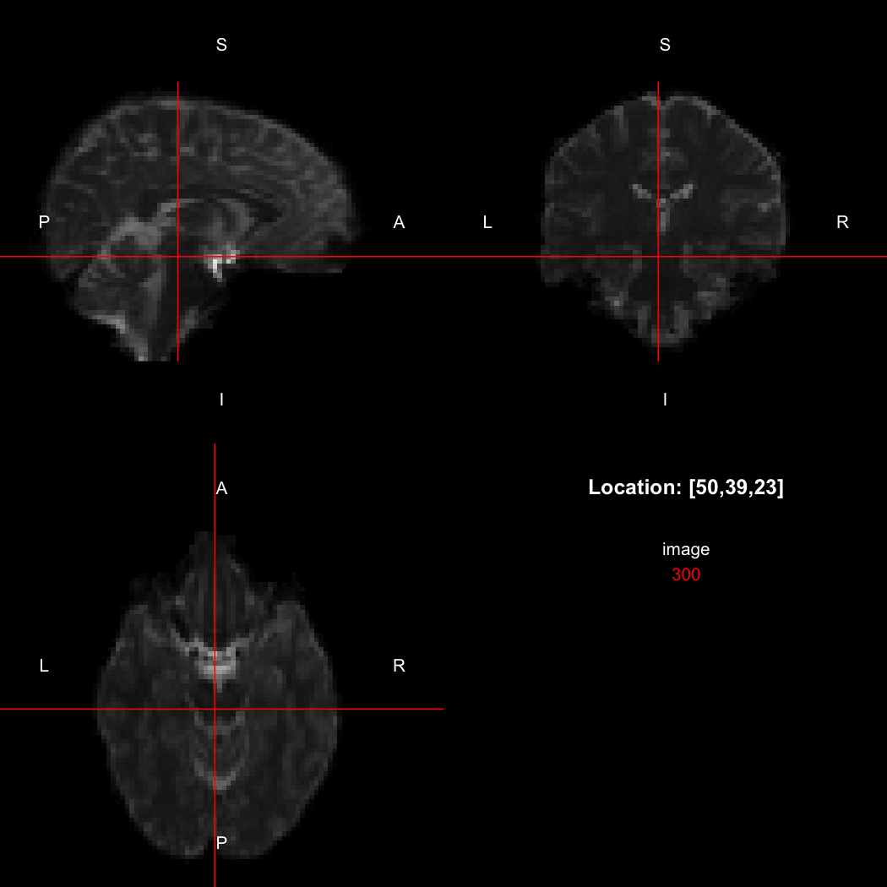
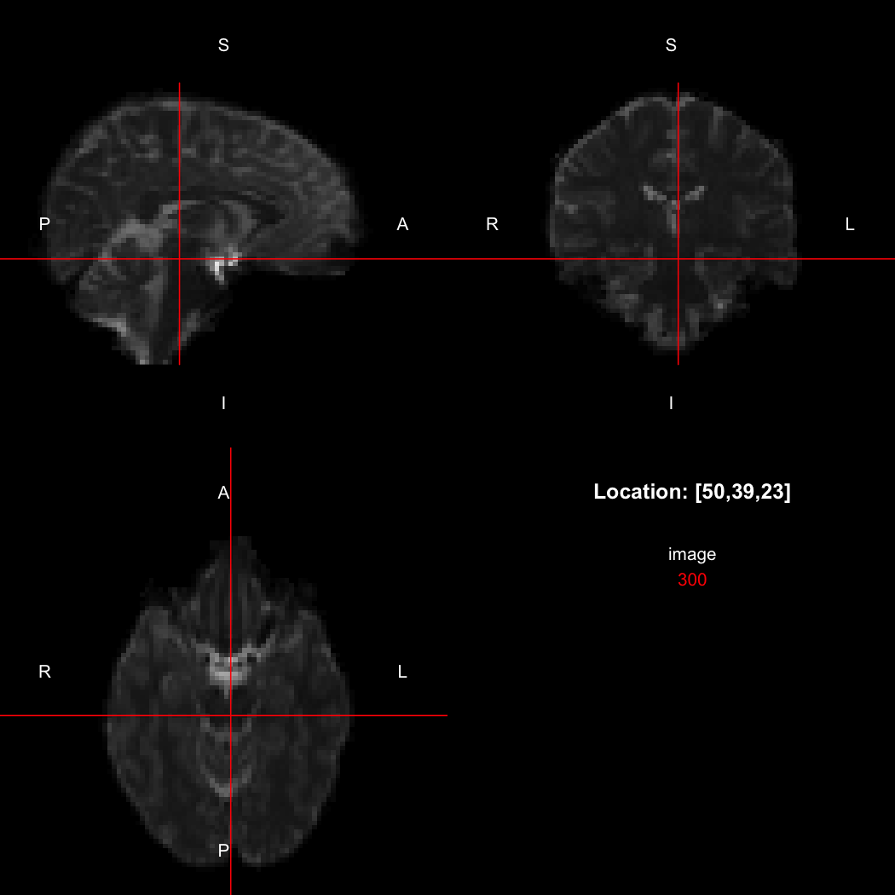
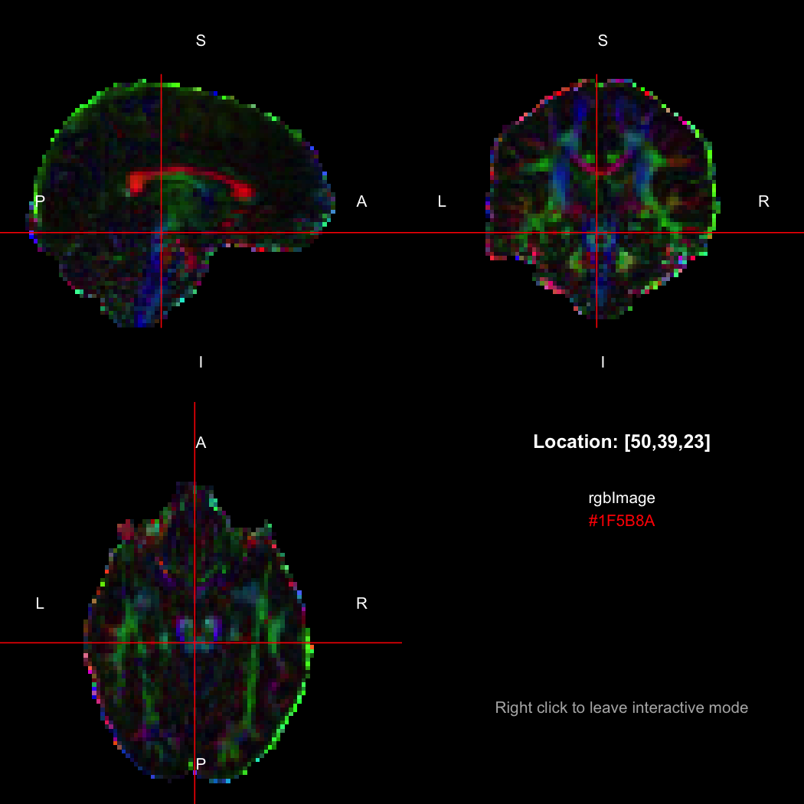

[](https://cran.r-project.org/package=RNifti) [](https://github.com/jonclayden/RNifti/actions/workflows/ci.yaml) [](https://app.codecov.io/gh/jonclayden/RNifti) [](https://cran.r-project.org/package=RNifti)

# RNifti: Fast R and C++ Access to NIfTI Images

The [NIfTI-1 format](https://www.nitrc.org/docman/view.php/26/64/nifti1.h) is a popular file format for storing medical imaging data, widely used in medical research and related fields. Conceptually, a NIfTI-1 file incorporates multidimensional numeric data, like an R `array`, but with additional metadata describing the real-space resolution of the image, the physical orientation of the image, and how the image should be interpreted. The [NIfTI-2 format](https://www.nitrc.org/docman/view.php/26/1302/nifti2_doc.html) was a later revision mostly to use wider data types for very large images.

There are several packages available for reading and writing NIfTI-1 files in R, and these are summarised in the [Medical Imaging task view](https://cran.r-project.org/view=MedicalImaging). However, `RNifti` is distinguished by its

- [extremely strong performance](#performance), in terms of speed;
- [C/C++ API](#api), allowing access to NIfTI images in compiled code in other R packages, or even in [standalone C++ code](#use-in-pure-c-projects); and
- modest dependencies, consisting of only R itself and the very widely-used [Rcpp](https://cran.r-project.org/package=Rcpp) C++ wrapper library.

The latest development version of the package can always be installed from GitHub using the `remotes` package.


```r
## install.packages("remotes")
remotes::install_github("jonclayden/RNifti")
```

**Please note that the `RNifti` package is to be used for research purposes only, and is not a clinical tool. It comes with no warranty.**

## Usage

The primary role of `RNifti` is to read and write NIfTI-1 and (since package version 1.2.0) NIfTI-2 files, either `gzip`-compressed or uncompressed, and provide access to image data and metadata. An image may be read into R using the `readNifti` function.


```r
library(RNifti)
image <- readNifti(system.file("extdata", "example.nii.gz", package="RNifti"))
```

This image is an R array with some additional attributes containing information such as its dimensions and the size of its pixels (or voxels, in this case, since it is a 3D image). There are auxiliary functions for extracting this information: the standard `dim()`, plus `pixdim()` and `pixunits()`.


```r
dim(image)
## [1] 96 96 60
pixdim(image)
## [1] 2.5 2.5 2.5
pixunits(image)
## [1] "mm" "s"
```

So this image is of size 96 x 96 x 60 voxels, with each voxel representing 2.5 x 2.5 x 2.5 mm in real space. (The temporal unit, seconds here, only applies to the fourth dimension, if it is present.) Replacement versions of the latter functions are also available, for modifying the metadata.

The package contains a basic image viewer, which can be used interactively or noninteractively to examine 2D or 3D images.


```r
view(image)
```



By default, the viewer shows labels indicating [image orientation](#image-orientation), crosshairs pinpointing the currently selected location, the numerical indices of the current location, and the value of the image at that location. Options allow each of these to be turned off, for the content of the bottom-right panel to be customised entirely, for the colour scale to be changed, and for additional images to be layered on top of the base image. See `?view` for details.

A fuller list of the raw metadata stored in the file can be obtained using the `niftiHeader` function.


```r
niftiHeader(image)
## NIfTI-1 header
##     sizeof_hdr: 348
##       dim_info: 0
##            dim: 3  96  96  60  1  1  1  1
##      intent_p1: 0
##      intent_p2: 0
##      intent_p3: 0
##    intent_code: 0 (Unknown)
##       datatype: 8 (INT32)
##         bitpix: 32
##    slice_start: 0
##         pixdim: -1.0  2.5  2.5  2.5  0.0  0.0  0.0  0.0
##     vox_offset: 352
##      scl_slope: 0
##      scl_inter: 0
##      slice_end: 0
##     slice_code: 0 (Unknown)
##     xyzt_units: 10
##        cal_max: 2503
##        cal_min: 0
## slice_duration: 0
##        toffset: 0
##        descrip: TractoR NIfTI writer v3.0.0
##       aux_file: 
##     qform_code: 2 (Aligned Anat)
##     sform_code: 2 (Aligned Anat)
##      quatern_b: 0
##      quatern_c: 1
##      quatern_d: 0
##      qoffset_x: 122.0339
##      qoffset_y: -95.18523
##      qoffset_z: -55.03814
##         srow_x: -2.5000  0.0000  0.0000  122.0339
##         srow_y: 0.00000  2.50000  0.00000  -95.18523
##         srow_z: 0.00000  0.00000  2.50000  -55.03814
##    intent_name: 
##          magic: n+1
```

Advanced users who know the NIfTI format well may want to alter elements of this metadata directly, and this can be performed using the `$` operator shorthand, as in


```r
image$intent_code <- 1
image$intent_code
## [1] 1
```

If you need to modify multiple metadata elements at once, or replace metadata wholesale with new information from another image, the `asNifti` function provides a more efficient interface. See `?asNifti` for details.

An image can be written back to NIfTI-1 format using the `writeNifti` function. `gzip` compression will be used if the specified file name ends with ".gz".


```r
writeNifti(image, "file.nii.gz")
```

## Image orientation

The NIfTI-1 and NIfTI-2 formats have a mechanism for indicating the physical orientation and location of the image volume in real space. The reference orientation has the left–right direction aligned with the x-axis, the posterior–anterior (back–front) direction aligned with the y-axis, and the inferior–superior (bottom–top) direction aligned with the z-axis; but "xform" information stored with an image can describe a transformation from that coordinate system to the one used by that particular image, in the form of an affine matrix. To obtain the full xform matrix for an image, call the `xform` function:


```r
xform(image)
##      [,1] [,2] [,3]      [,4]
## [1,] -2.5  0.0  0.0 122.03390
## [2,]  0.0  2.5  0.0 -95.18523
## [3,]  0.0  0.0  2.5 -55.03814
## [4,]  0.0  0.0  0.0   1.00000
## attr(,"imagedim")
## [1] 96 96 60
## attr(,"code")
## [1] 2
```

Just the rotation with respect to the canonical axes can be obtained with the `rotation` function:


```r
rotation(image)
##      [,1] [,2] [,3]
## [1,]   -1    0    0
## [2,]    0    1    0
## [3,]    0    0    1
```

In this case, the image is flipped along the x-axis relative to the canonical axes, so the positive x-direction points towards the left rather than the right. This is compactly represented by the output of the `orientation` function, which indicates the approximate real-world directions of the positive axes in each dimension.


```r
orientation(image)
## [1] "LAS"
```

So, here, "LAS" means that the positive x-axis points left, the positive y-axis anterior and the positive z-axis superior. This is the so-called "radiological" orientation convention, and can be requested when viewing images for those who are used to it:


```r
view(image, radiological=TRUE)
```



Notice the left (L) and right (R) labels, relative to the view shown above. Setting the `radiologicalView` option to `TRUE` will make this the default for all future views.

There is a replacement version of the `orientation` function, which will reorient the image to align with the requested directions. This is a relatively complex operation, affecting the xform and the storage order of the data.


```r
image[50,39,23]
## [1] 300
orientation(image) <- "RAS"
xform(image)
##      [,1] [,2] [,3]       [,4]
## [1,]  2.5  0.0  0.0 -115.46610
## [2,]  0.0  2.5  0.0  -95.18523
## [3,]  0.0  0.0  2.5  -55.03814
## [4,]  0.0  0.0  0.0    1.00000
## attr(,"imagedim")
## [1] 96 96 60
## attr(,"code")
## [1] 2
image[50,39,23]
## [1] 310
image[47,39,23]
## [1] 300
```

Notice that the sign of the top-left element of the xform has now flipped, and the value of the image at location (50,39,23) has changed because the data has been reordered. The equivalent x-location is now 47, which is the 50th element counting in the other direction (96 - 50 + 1 = 47).

This latter operation can be useful to ensure that indexing into several images with different native storage conventions will end up always having approximately the same meaning (and it is performed internally by the viewer, if required). It is non-destructive, because no interpolation of the data is performed. This means that the axes will not exactly align with the requested directions if the original image was oblique to the canonical axes, but conversely it ensures that no degradation in the image will result. (The [`RNiftyReg` package](https://github.com/jonclayden/RNiftyReg) can be used to apply an arbitrary rotation to an image and interpolate the data onto the new grid, if required.)

## Support for composite types

The NIfTI standard supports composite types such as complex-valued and RGB images, and support for these was added in version 1.0.0 of this package. Complex data is exposed to R using the standard `complex` vector type:


```r
image <- readNifti(system.file("extdata", "example.nii.gz", package="RNifti"))
complexImage <- asNifti(image + 0i)
print(complexImage)
## Image array of mode "complex" (8.4 Mb)
## - 96 x 96 x 60 voxels
## - 2.5 x 2.5 x 2.5 mm per voxel
complexImage[50,39,23]
## [1] 300+0i
```

R's native representation for RGB values is [CSS-style hex strings](https://en.wikipedia.org/wiki/Web_colors) of character mode, which are reasonably space-efficient (8 or 10 bytes per value) but a little clunky to work with. For efficiency of interchange between R and the NIfTI-internal datatypes, `RNifti` uses a byte-packed representation of integer mode instead, which takes up 4 bytes per value. Of course, the viewer understands this format.


```r
rgbImage <- readNifti(system.file("extdata", "example_rgb.nii.gz", package="RNifti"))
print(rgbImage)
## Image array of mode "integer" (2.1 Mb)
## - 96 x 96 x 60 voxels
## - 2.5 x 2.5 x 2.5 mm per voxel
class(rgbImage)
## [1] "niftiImage" "rgbArray"   "array"
view(rgbImage)
```



Notice that values are shown in the viewer using R's conventional hex string format, but the data is of class `rgbArray`. The function of the same name can be used to create these arrays from strings or channel values, for the purposes of building RGB images from data, while the `as.character` method and `channels` function perform the opposite conversions.


```r
as.character(rgbImage, flatten=FALSE)[50,39,23]
## [1] "#1F5B8A"
channels(rgbImage, "red")[50,39,23,1]
## red 
##  31
```

RGB images with an alpha (opacity) channel are also supported.

## Performance

The `RNifti` package uses the robust and widely used [NIfTI reference implementation](https://www.nitrc.org/projects/nifti/), which is written in C, to read and write NIfTI files. It also uses the standard NIfTI-2 data structure as its canonical representation of an image in memory. Together, these make the package extremely fast, as the following benchmark against packages [`AnalyzeFMRI`](https://cran.r-project.org/package=AnalyzeFMRI), [`ANTsRCore`](https://github.com/ANTsX/ANTsRCore),  [`neuroim`](https://cran.r-project.org/package=neuroim), [`oro.nifti`](https://cran.r-project.org/package=oro.nifti) and [`tractor.base`](https://cran.r-project.org/package=tractor.base) shows.


```r
installed.packages()[c("AnalyzeFMRI","ANTsRCore","neuroim","oro.nifti","RNifti",
                       "tractor.base"), "Version"]
##  AnalyzeFMRI    ANTsRCore      neuroim    oro.nifti       RNifti tractor.base 
##     "1.1-24"      "0.7.5"      "0.0.6"     "0.11.0"      "1.4.0"    "3.3.3.1"

library(microbenchmark)
microbenchmark(AnalyzeFMRI::f.read.volume("example.nii"),
               ANTsRCore::antsImageRead("example.nii"),
               neuroim::loadVolume("example.nii"),
               oro.nifti::readNIfTI("example.nii"),
               RNifti::readNifti("example.nii"),
               RNifti::readNifti("example.nii", internal=TRUE),
               tractor.base::readImageFile("example.nii"), unit="ms")
## Unit: milliseconds
##                                               expr       min         lq
##          AnalyzeFMRI::f.read.volume("example.nii") 29.734889 30.8786055
##            ANTsRCore::antsImageRead("example.nii")  3.336989  4.0922635
##                 neuroim::loadVolume("example.nii") 37.631847 39.6159530
##                oro.nifti::readNIfTI("example.nii") 39.190034 42.4400090
##                   RNifti::readNifti("example.nii")  1.928004  2.2818390
##  RNifti::readNifti("example.nii", internal = TRUE)  0.392529  0.7233765
##         tractor.base::readImageFile("example.nii") 13.726200 16.8920740
##        mean    median        uq         max neval
##  43.1935622 32.127420 37.147587  873.351879   100
##  22.1543773  4.538117  5.270167 1727.918618   100
##  63.6164186 41.908256 51.502174 1583.497529   100
##  67.8210527 49.280901 57.436492  578.222950   100
##   5.3772204  2.415228  2.741401  179.865678   100
##   0.8355802  0.836148  0.951779    1.470726   100
##  25.9411984 19.371901 26.144958  274.506899   100
```

With a median runtime of less than 2.5 ms, `RNifti` is typically around ten times as fast as the alternatives to read this image into R. The exception is `ANTsRCore`, which uses a similar low-level pointer-based arrangement as `RNifti`, and is therefore comparable in speed. However, `ANTsRCore` has substantial dependencies, which may affect its suitability in some applications.

Moreover, when reading the file into an "internal" image, which does not copy the pixel values into R data structures until they are required, the median runtime drops by a further 65%, to just 840 µs. This saves time and memory, while still allowing data access through standard R indexing operations.

## Implementation details

The package does not fully duplicate the NIfTI structure's contents in R-visible objects. Instead, it passes key metadata back to R, such as the image dimensions and pixel dimensions, and it also passes back the pixel values where they are needed. Finally, it creates an [external pointer](https://r-manuals.flakery.org/R-exts.html#External-pointers-and-weak-references) to the native data structure, which is stored in an attribute. This pointer is dereferenced whenever the object is passed back to the C++ code, thereby avoiding unnecessary duplication and ensuring that all metadata remains intact. The full NIfTI-1 header can be obtained using the `niftiHeader` R function, if it is needed.

This arrangement is efficient and generally works well, but certain R operations strip attributes—in which case the external pointer will be removed. The internal structure will be built again when necessary, but using default metadata. In these cases, if it is important to keep the original metadata, the `asNifti` function should be called explicitly, with a template object. This reconstructs the NIfTI data structure, using the template as a starting point.

## API

It is possible to use the package's NIfTI-handling code in other R packages' compiled code, thereby obviating the need to duplicate the reference implementation. Moreover, `RNifti` provides two key C++ wrapper classes:

- `NiftiImage`, which simplifies memory management and supports the package's internal image pointers and associated reference counting, and
- `NiftiImageData`, which encapsulates the pixel data within an image, and handles datatype multiplexing and data scaling, as well as providing indexing, iterators and other niceties.

Full doxygen documentation for these classes is available at <https://doxygen.flakery.org/RNifti/>, and is also provided with package releases.

A third-party package can use the `NiftiImage` class by including

```
LinkingTo: Rcpp, RNifti
```

in its `DESCRIPTION` file, and then including the `RNifti.h` header file. For example,

```c++
#include "RNifti.h"

void myfunction ()
{
    RNifti::NiftiImage image("example.nii.gz");
    // Do something with the image
}
```

If you're using the `sourceCpp` function from `Rcpp`, you may also need to add the attribute line

```c++
// [[Rcpp::depends(RNifti)]]
```

to the top of your C++ source file.

In addition to the one taking a file path, there are also constructors taking a `SEXP` (i.e., an R object), another `NiftiImage`, or a `nifti_image` structure from the reference implementation. `NiftiImage` objects can be implicitly cast to pointers to `nifti_image` structs, meaning that they can be directly used in calls to the reference implementation's own API. The latter is accessed through the separate `RNiftiAPI.h` header file.

```c++
#include "RNifti.h"
#include "RNiftiAPI.h"

void myfunction (SEXP image_)
{
    RNifti::NiftiImage image(image_);
    const size_t volsize = nifti_get_volsize(image);
}
```

(`RNifti` will also have to be added to the `Imports` list in the package's `DESCRIPTION` file, as well as `LinkingTo`.) The `RNiftiAPI.h` header should only be included once per package, since it contains function implementations. Multiple includes will lead to duplicate symbol warnings from your linker. Therefore, if multiple source files require access to the NIfTI-1 reference implementation, it is recommended that the API header be included alone in a separate ".c" or ".cpp" file, while others only include the main `RNifti.h`.

`RNifti` is not specifically designed to be thread-safe, and R itself is expressly single-threaded. However, some effort has been made to try to minimise problems associated with parallelisation, such as putting R API calls within a critical region if OpenMP is being used. If you are using the API in a package that does use OpenMP or another form of threads, it is wise to preregister the functions exported by `RNifti` before use, by calling `niftilib_register_all()`. In single-threaded contexts this is optional, and will be performed when required.

Packages must choose which version of the NIfTI library to work with, since their definitions of the core `nifti_image` structure are incompatible. By default the NIfTI-1 version is used, but the NIfTI-2 version may be chosen instead by defining `RNIFTI_NIFTILIB_VERSION` to 2 before including `RNifti.h`. [The header file](https://github.com/jonclayden/RNifti/blob/master/inst/include/RNifti.h) itself contains more detailed documentation. The [`clients` directory](https://github.com/jonclayden/RNifti/tree/master/clients) has stub examples of packages using each version of the library.

## Use in pure C++ projects

Thanks to contributions from [Matt Hall](https://github.com/soolijoo), it is possible (as of package version 0.7.0) to use the `NiftiImage` C++ class in standalone C++ projects. The [`standalone` directory](https://github.com/jonclayden/RNifti/tree/master/standalone) provides a minimal example, as well as further documentation, and its contents can be copied to a new directory (including symlinked files) as a new project template.
